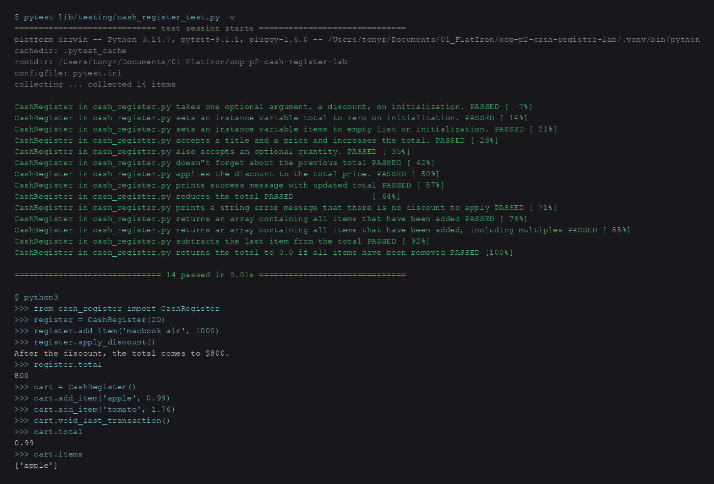

# Cash Register

A Python cash register for an e-commerce checkout flow. It keeps a running total, records every item, applies an optional percent-off discount, and can void the last sale.

## Screenshot



## Features

- Optional discount on initialization (defaults to `0`)
- Discount must be an integer from `0` to `100`; invalid values print `Not valid discount`
- `add_item(item, price, quantity=1)` updates the total, item list, and transaction history
- `apply_discount()` takes that percent off the current total
- `void_last_transaction()` removes the last sale from the total, items, and history

## Installation

```bash
git clone https://github.com/tony7464/oop-p2-cash-register-lab.git
cd oop-p2-cash-register-lab
python3 -m venv .venv
source .venv/bin/activate
pip install pytest
```

## Usage

```python
from cash_register import CashRegister

register = CashRegister(20)
register.add_item("macbook air", 1000)
register.add_item("usb-c hub", 25, 2)
register.apply_discount()
# After the discount, the total comes to $840.

register.void_last_transaction()
print(register.items)  # ['macbook air']
print(register.total)  # 800
```

`quantity` defaults to `1`. Each unit is stored in `items`, and each `add_item` call is stored in `previous_transactions` as `{"item", "price", "quantity"}`.

If the register has no discount, `apply_discount()` prints `There is no discount to apply.`  
If there is nothing to undo, `void_last_transaction()` prints `There is no transaction to void.`

## Tests

```bash
.venv/bin/pytest lib/testing/cash_register_test.py -v
```

## License

This lab is Flatiron School educational content. See [LICENSE.md](LICENSE.md).
